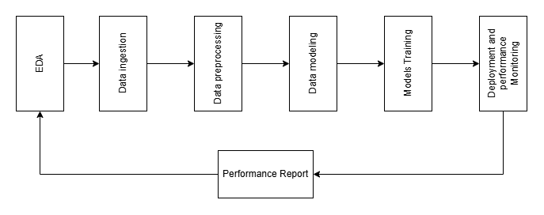

# Red Eye
### Preparation

Social Media Analysis based profiling system is a profiling system that profiles users, persons based on their intersts, relationships, activities, and public infos on their social media accounts, in the age of data it's essential to know how to use the public and allowed data in order to enhance our industries, a company which use this concept is called Data-Driven-Company, one of operations that appears specially in marketing and hr levels is called Data-Based-Profiling which means to label a user with special attributes that represent some domain specific characteristic, where this profiling happens based on other activites or inputs about the user / person.

## Table of Content

<ul>
    <li>
        <a href="#installation" style="font-size: medium">Installation</a>
    </li>
        <li>
        <a href="#usage" style="font-size: medium">Usage</a>
    </li>
        <li>
        <a href="#tech-stack" style="font-size: medium">Tech Stack</a>
    </li>
</ul>

## Installation

## Usage
pipelines and models are accessable to use via a Command Line Interface
- Put the folder path the project exist at in the Enviroment System Variable / or use it directly from the folder
- Run the file <strong>main.py</strong> to enter the CLI

These are the available commands:

    <table>
        <tr style="font-size:16px">
            <th>Command</th>
            <th>Parameters</th>
            <th>Usage</th>
        </tr>
        <tr>
            <td class="command">Hello</td>
            <td>Hello</td>
            <td>Hello</td>
        </tr>
    </table>

## Tech stack

1. #### <b style="font-size: medium">Neo4j</b> as a graph database that supports performing domain knowledge

2. #### <b style="font-size: medium"> Python</b> and it's data science / analysis tools <b>(Numpy, Matplotlib, Pandas, seaborn)</b>

3. #### <b style="font-size: medium">Networkx</b> library to work with node edges files

4. #### <b style="font-size: medium">Scikit learn</b> and tensorflow

 

## Architecture

 <b style="font-weight: bold; font-size: medium">The Conceptual Diagram</b> </img>

 

## Data & Resources

    1. Online Social Networks Dataset ("https://athinagroup.eng.uci.edu/projects/online-social-networks/online-social-networks-dataset")
        - Facebook Egonet Samples
        - Last.fm Multigraph
        - Facebook Social Graph – MHRW & UNI
        - Facebook Social Graph – Breadth First Search
        - Facebook Weighted Random Walks
